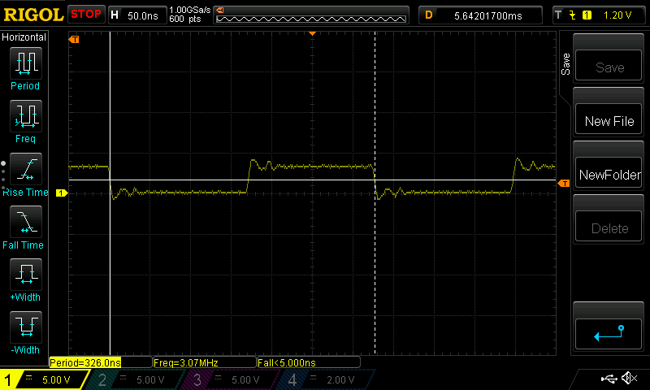
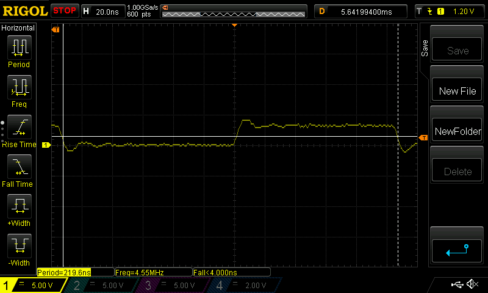
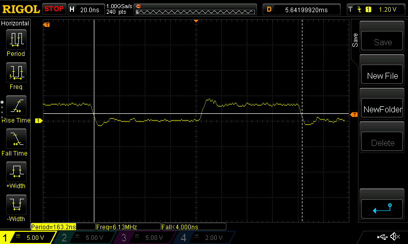
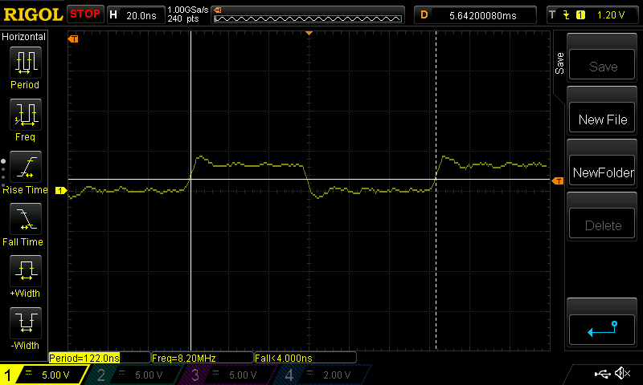

# pico-overclock

This is a small example of overclocking a Raspberry Pi Pico. I wanted to check
that the overclock was working and that my assumptions were correct.

The code contains a loop which pauses for 20 NOP instructions, the raises a
GPIO, then pauses 20 more NOPs, then lowers the GPIO, then jumps back to
repeat. It compiles to this:

	200001ac:	46c0      	nop			; (mov r8, r8)
	200001ae:	46c0      	nop			; (mov r8, r8)
	200001b0:	46c0      	nop			; (mov r8, r8)
	200001b2:	46c0      	nop			; (mov r8, r8)
	200001b4:	46c0      	nop			; (mov r8, r8)
	200001b6:	46c0      	nop			; (mov r8, r8)
	200001b8:	46c0      	nop			; (mov r8, r8)
	200001ba:	46c0      	nop			; (mov r8, r8)
	200001bc:	46c0      	nop			; (mov r8, r8)
	200001be:	46c0      	nop			; (mov r8, r8)
	200001c0:	46c0      	nop			; (mov r8, r8)
	200001c2:	46c0      	nop			; (mov r8, r8)
	200001c4:	46c0      	nop			; (mov r8, r8)
	200001c6:	46c0      	nop			; (mov r8, r8)
	200001c8:	46c0      	nop			; (mov r8, r8)
	200001ca:	46c0      	nop			; (mov r8, r8)
	200001cc:	46c0      	nop			; (mov r8, r8)
	200001ce:	46c0      	nop			; (mov r8, r8)
	200001d0:	46c0      	nop			; (mov r8, r8)
	200001d2:	46c0      	nop			; (mov r8, r8)
	200001d4:	6162      	str	r2, [r4, #20]
	200001d6:	46c0      	nop			; (mov r8, r8)
	200001d8:	46c0      	nop			; (mov r8, r8)
	200001da:	46c0      	nop			; (mov r8, r8)
	200001dc:	46c0      	nop			; (mov r8, r8)
	200001de:	46c0      	nop			; (mov r8, r8)
	200001e0:	46c0      	nop			; (mov r8, r8)
	200001e2:	46c0      	nop			; (mov r8, r8)
	200001e4:	46c0      	nop			; (mov r8, r8)
	200001e6:	46c0      	nop			; (mov r8, r8)
	200001e8:	46c0      	nop			; (mov r8, r8)
	200001ea:	46c0      	nop			; (mov r8, r8)
	200001ec:	46c0      	nop			; (mov r8, r8)
	200001ee:	46c0      	nop			; (mov r8, r8)
	200001f0:	46c0      	nop			; (mov r8, r8)
	200001f2:	46c0      	nop			; (mov r8, r8)
	200001f4:	46c0      	nop			; (mov r8, r8)
	200001f6:	46c0      	nop			; (mov r8, r8)
	200001f8:	46c0      	nop			; (mov r8, r8)
	200001fa:	46c0      	nop			; (mov r8, r8)
	200001fc:	46c0      	nop			; (mov r8, r8)
	200001fe:	61a2      	str	r2, [r4, #24]
	20000200:	e7d4      	b.n	200001ac <main+0x50>

That's 44 machine cycles per iteration, and the GPIO can be seen on a
'scope toggling at a constant frequency.

## Here's a 'scope image from a Pico running at the standard 135MHz:

| Content     | ns per cycle | Cycles | Total Cycles |
| ----------- | ------------ | ------ | ------------ |
| 40 NOPs     | 7.4074       |  40    | 296.296      |
| 2 GPIOs     | 7.4074       |   2    | 14.8148      |
| Branch      | 7.4074       |   2    | 14.8148      |

325.9256ns, 'scope says 326.0ns

## ...and at 200MHz:

| Content     | ns per cycle | Cycles | Total Cycles |
| ----------- | ------------ | ------ | ------------ |
| 40 NOPs     | 5.0000       |  40    | 200.000      |
| 2 GPIOs     | 5.0000       |   2    | 10.0000      |
| Branch      | 5.0000       |   2    | 10.0000      |

220.0000ns, 'scope says 219.6ns

## ...and at 270MHz:

| Content     | ns per cycle | Cycles | Total Cycles |
| ----------- | ------------ | ------ | ------------ |
| 40 NOPs     | 3.7037       |  40    | 148.148      |
| 2 GPIOs     | 3.7037       |   2    | 7.4074       |
| Branch      | 3.7037       |   2    | 7.4074       |

162.9628ns, 'scope says 163.2ns

## ...and at 360MHz:

| Content     | ns per cycle | Cycles | Total Cycles |
| ----------- | ------------ | ------ | ------------ |
| 40 NOPs     | 2.7777       |  40    | 111.108      |
| 2 GPIOs     | 2.7777       |   2    | 5.5554       |
| Branch      | 2.7777       |   2    | 5.5554       |

122.2188ns, 'scope says 122.0ns

So the overclocking appears to work and the timings are as expected.